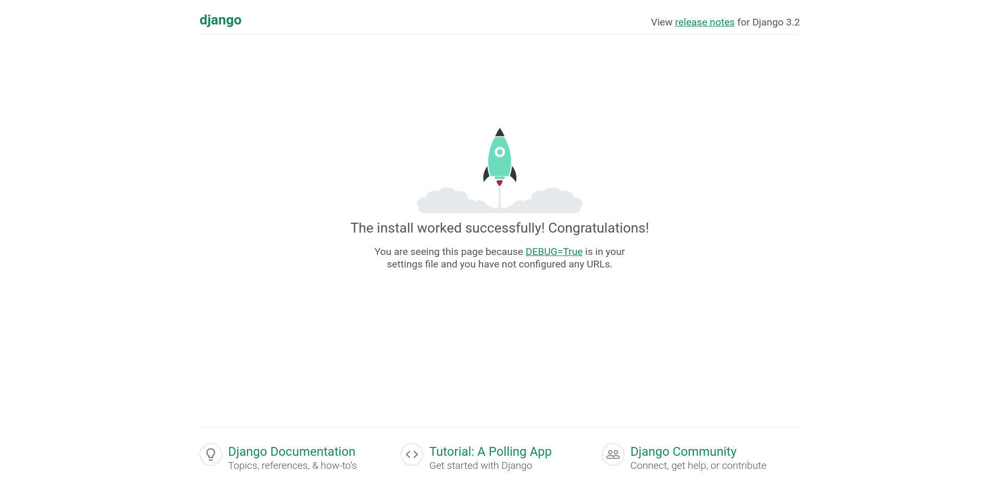
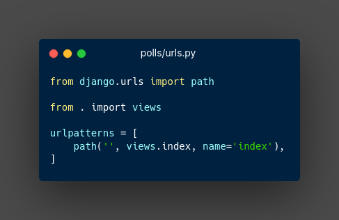
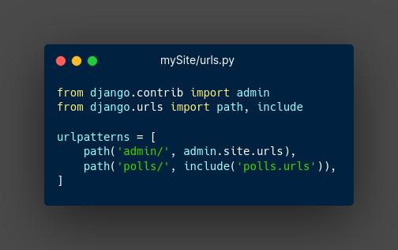
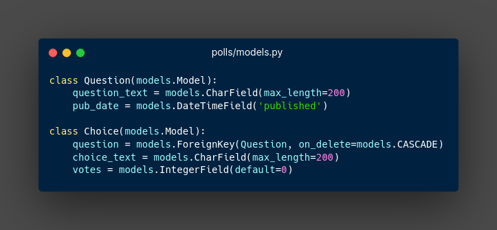
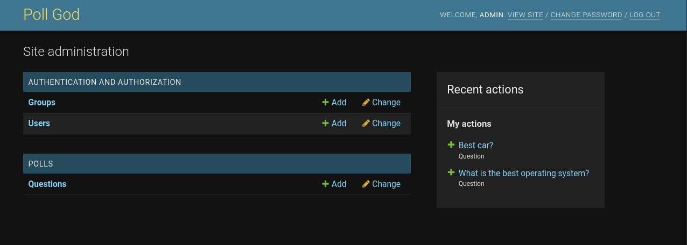
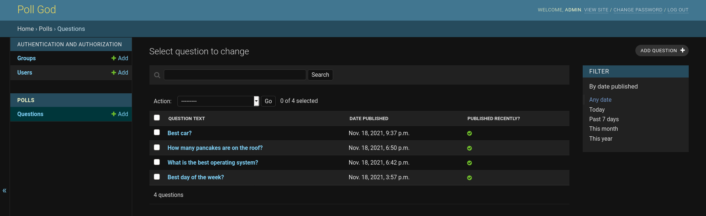
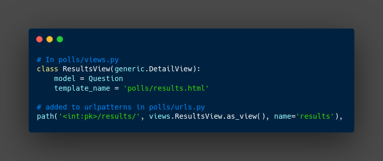
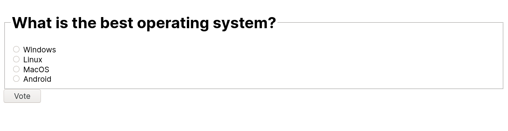
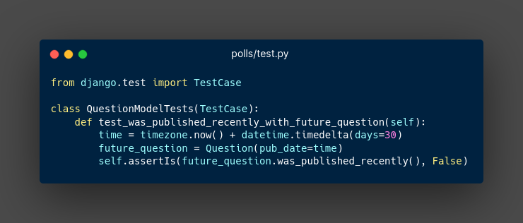
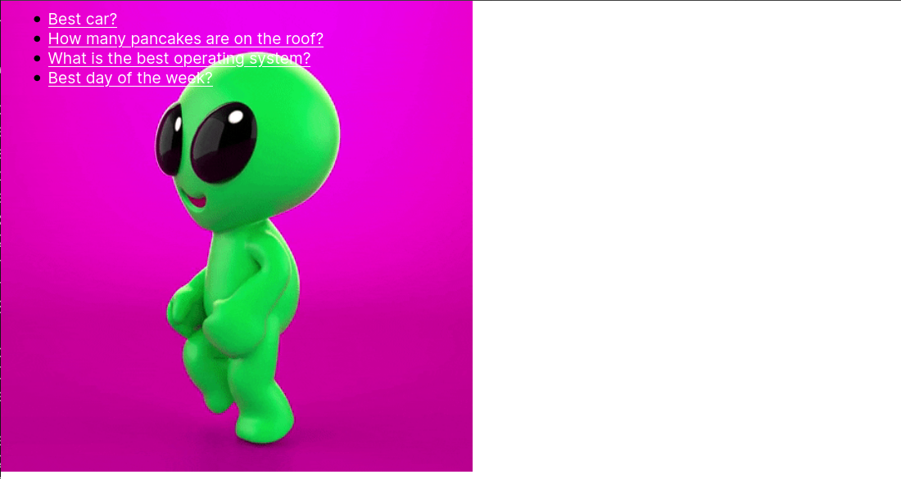

# Python and Django Spike Project Report

## By: Matt Goodwin

### Main Goals

​	My goals when choosing a spike project on pythons Django module was to be able to create and deploy apps and websites quickly while also connecting to a database for information storage. The thing that drew me to Django was the fact that the entire website base is run by a python module  leaving all the important stuff (creating pages, database management, styling) for the developer to worry about. Another appealing feature Django offers is the ability to create many apps for one website that can be used and copied for future projects. Everything in the Django framework is created to be reusable in the future along with all the styles, models, and apps.

## Experiment/Project

###### Link to project: https://github.com/mngoodwin/Spike-Project

### Project Start

​	My project started with initially creating the Django project which was as simple as `django-admin startproject mySite` creating the entire project directory for the developer, including a manage.py file that is used to run the project and a settings.py and urls.py file which will be important later. Now the site can be tested by running `python3 manage.py runserver`and viewing `http://127.0.0.1:8000` to see the stock development page. 

### App Development

​	The next step in development is creating an app for the website to run. A site can run many apps and databases and you are able to add as many as you want. Creating an app is also a one line command in the site folder being `python3 manage.py startapp <app name>`and in my case, a polls app. This creates the framework for the app for the site to use. The main objective in this part of development is connecting the app to the main site page and we do that by adding the polls path to the sites urls.py file and adding the site path to the polls urls.py file.

 

​	Adding the path to the polls and site urls.py, the app is now mapped to the main site making it possible to access the page `http://127.0.0.1:8000/polls/` but only returns an empty page at the moment, but it's there so thats a win. Next, I moved on to setting up the database and Django is very helpful in that case as it creates a default sqlite3 database for use in the project. The only thing that needs to be updated initially is the timezone for that database in the main sites `settings.py`.

### Linking Database

​	Now that all the pieces are in place given you either changed databases and filled in the credentials or just using the default sqlite3 database, you need to migrate the database changes to the main site and to do this you use `python3 manage.py migrate`. This will create, delete or alter any database that needs it.

### App Models

​	Now that the database is setup and linked to the site, I was now able to create the models for the polls app that would be used to create and insert things into the sqlite3 database. The models are given variables and fields which would represent the column names and the column type respectively. In my app i had two models, one for questions with the text and date publish and another one for the choices of the question which has a foreign key referring to the question, the choice text, and how many votes the choice got. These models create a way for the app to generically talk to the database when values are entered.

<figure align="center">
    
</figure>

Now I needed to added the polls app (`polls.apps.PollsConfig`) to the sites installed apps which is in the sites setting.py file and migrate the models to the main site. The installed_apps section is read every time the server is run so adding the polls app configuration makes it recognizable by the main site. Finally, i had to migrate the models in the app to the main site by using `python3 manage.py makemigrations polls`,  and then `python3 manage.py migrate` to create the model tables in your database. Now the site will recognize the app along with the models it includes.

### Admin Panel

​	Django comes built in with a default admin dashboard that the developer can use at `127.0.0.1:8000/admin`, but I first needed to create an admin account with `python3 manage.py createsuperuser` and entering credentials.

From this page I was able to do many things like adding a user and adding poll questions.

This dahsboard was very helpful in adding, changing, and removing entries in the tables as it is much more user friendly than using Djangos API for a python shell.

### Creating the Views

​	Now that the database and app are connected to the site, it was time to code the render part of the page that the app returns to the site. Django is helpful as it has many built-in functions and templates to make this process easier, those being **render** and **generic**. To render a page, the polls `urls.py` file needs to know the location of the views by adding a path to each view and for the polls `view.py` to return a rendered page. An example would be the page viewing the votes of a question, to the polls `view.py` I updated the function to return a render to the site to display. While this is nice, Django comes with templates that make rendering even easier by using a generic template.

<figure align="center">
    
</figure>

### Functionality

​	The next step in the process was creating a form template for the polls app pages in the `polls/template/polls/` directory. This directory is checked for templates for  before the sites templates directory so you are able to create custom templates for certain apps while also defaulting to the sites template if none exist for the app. While coding html for the Django server to read, there are new identifiers that Django will recognize and run as python code. The header for the basic form to vote is `form action="" method="post">` and while the method is a normal post, the action and anything between `` is interpereted differently than nomal html, but instead with python.  So I was able to update the views correctly and added a button for the vote resulting in a page like below.

<figure align="center">
    
</figure>

### Test

​	Django, again, makes thing very simple for developers as there is TestCases class Django provides when creating a test file for an app. A test case I used in my project was to check if the post will be marked "Posted Recently" if it was posted in the future (impossible) or not, checking if the returned response is False.

<figure align="center">
    
</figure>

And to run the test, I ran `python3 manage.py test polls` in the main site directory which gives you a number on how many of the tests it passed. I am able to add in as many test as i want to the `test.py` file as Django will always use the test file in the app natively.

### Looks

​	Besides from the functionality of the app, the look and feel of the app is very important. To create a styling sheet for my app I first needed to create another directory in polls called `/polls/static/polls` and created a `style.css` sheet in this directory as it will look here first for the styling first. From here I was able to edit css while also storing things like pictures to be referenced. The last thing to do is add a reference to the css page in the html pages being `<link rel="stylesheet" type="text/css" href="">`.  And the final product

<figure align="center">
    
</figure>

### Question/Connection

​	This entire development process connects really well with the idea of plug-and-play apps and quick website deployment. The main feature I like in Django is the integration between the back-end database, be it mysql or sqlite3, and python. Deploying a website takes close to no effort as Django formats and structures the entire project so you just have to edit it. I think this relates to software engineering as it a modern type of code template and website structure for development. Unfortunately, I cant incorporate this into our project as it is an all in one project the maps the whole site.

### Reflection

​	I feel I accomplished my main goals as I was mainly looking for a way to connect python to a database. I learned a lot about how the actual app is making calls  and request to the database and all the tools Django offers so you really don't need to touch the database directly. While my main goal initially what just to get familiar with python to database, I also learned a lot about how the sitemap is managed and called by Django. Overall, I learned a lot during this project and started using Django to start other projects for fun as it is so simple and developer friendly. 
